<!--
  LIVE AT: github.com/ibuilder/ibuilder  (branch: master)
  Commit banner.svg alongside this file (or in assets/ and update the src below).
  Do NOT use the S3/presigned image URL — it expires. Commit the file.
  "Favorite repos" = pinned repos: profile → "Customize your pins".
-->

<div align="center">
  <a href="https://massing.build"></a>

  <p>
    <a href="https://mattemma.blog">Website</a> ·
    <a href="https://linkedin.com/in/memma">LinkedIn</a> ·
    <a href="https://twitter.com/ibuilder">X</a> ·
    <a href="mailto:iphoenix@gmail.com">Email</a>
  </p>
</div>

---

## Future systems for the built world

I build software for the exact workflows I have lived in — development, design coordination, construction execution, handover, and operations. The through-line is simple: **a project should not fracture across disconnected tools when the asset itself is one continuous system.**

```text
site → geometry → scope → schedule → cost → build → handover → operations
```

That view comes from both sides of the table. Fifteen-plus years leading construction in the field — **$490M+ delivered, 600+ tradespeople led** — a Director-of-BD track record selling con-tech to sophisticated buyers, and a Procore rollout that unlocked **$2.5M+/month of work-in-place** on a $200M program. So I can talk shop with a super, a CFO, or a staff engineer, and build the product deeply enough to back it up.

I build software for the people I used to be.

---

## What I'm building

Three open-source projects, one thesis: the project is a single continuous system. **One models it, one reasons about it, one watches it.**

### 🧊 [Massing](https://github.com/ibuilder/massing) — model it
[](https://github.com/ibuilder/massing/stargazers) [](https://github.com/ibuilder/massing/blob/main/LICENSE) · **[massing.build](https://massing.build)**

Open, self-hosted, **IFC-native** AEC platform — the whole lifecycle on a single model, no proprietary format and no per-seat license.

- **BIM authoring + viewer** — model from a blank IFC (walls, steel, rebar, MEP), generate a permit-ready construction-document set, pre-check IBC code, hand over LOD-500 as-built data
- **GC portal** — ~100 config-driven modules: RFIs, submittals, change-order chain, AIA pay apps, CPM, and construction accounting (double-entry GL/WIP → QuickBooks, e-sign)
- **Development & feasibility** — zoning envelope → generated IFC building → underwriting (XIRR/NPV, JV waterfall, Monte Carlo), disposition and tri-approach appraisal
- **Standards & ops** — ISO 19650 CDE, Discipline Spine, Facility Condition Assessment, Last Planner board, and an **MCP server** so agents can drive the project

> `Vite · Three.js · IfcOpenShell` on the web · `FastAPI · Postgres · MinIO` on the API · free offline desktop build

### 📐 [Master Builder](https://github.com/ibuilder/master-builder) — reason about it
 

An installable **Claude Skill** that makes an AI reason like a master builder instead of a generic assistant — one mind holding an entire built-asset project from raw land through design, construction, handover, operations, and disposition, **anywhere in the world.**

The core rule: there is no generic building. Ground every answer in a real place, derive the constraints from there, and follow the money and the risk to their conclusions. A lean `SKILL.md` plus seven reference modules — global codes and AHJs, the development lifecycle, real-estate finance, construction delivery, the digital toolkit, a build doctrine distilled from real platforms, and a forensic pro-forma review.

> Distilled from 22+ years of practice. Standards verified against current editions — IBC 2024 / ASCE 7-22, Eurocodes, NCC 2025, ISO 19650 + IFC, LEED v5.

### 🦅 [Osprey](https://github.com/ospreyhq) — watch it
 

A free, open-source, cross-platform **background agent** for the built environment. It runs quietly, connects to the systems a project already lives in, analyzes what's moving, and surfaces a prioritized **hotlist** — what actually needs attention today.

- **Connectors** — Outlook / O365, Gmail, Procore, Sage, Argus and similar AEC/RE platforms
- **Output** — a ranked hotlist, exportable to Excel and PDF
- **Runs everywhere** — Windows, macOS, iOS, Android; self-hostable, enterprise-grade security

> The signal that a project is in trouble is almost always already sitting in someone's inbox. Osprey surfaces it in time.

<sub>**Also in the workshop:** ProcoreWP (a Procore-to-web layer for publishing project data outside the closed system boundary) · Atlas (a systems-map for navigating how geometry, workflows, and project intelligence connect).</sub>

---

### 🛠️ Stack

[](https://skillicons.dev)

**Con-tech:** Procore · BuildingConnected · Autodesk Navisworks · Primavera P6
**Certifications:** Procore (Associate · Superintendent · Developer) · OSHA 30 · NYC DOB Construction Superintendent · FDNY Fire Safety Manager
**Affiliations:** NAIOP · REBNY · CCIM

### 🏛️ Signature work

- **Madison Square Garden Transformation** — BIM/MEP coordination, 200+ union trades/day
- **Amazon HQ** — 850K SF core & shell TCO turnover (WeWork)
- **830 Brickell** — 130K SF six-floor fit-out preconstruction (Miami)
- **NC Museum of History** — $142M renovation & expansion (Balfour Beatty JV)
- **eManager** — national web system for change orders, daily reports and document control (Turner)

### 🎓 Education

**Georgetown University** — M.S., Real Estate Finance (2021)
**Virginia Tech** — B.S., Building Construction (2009)

---

## Philosophy

The built environment runs on fragmented software designed around narrow handoffs. I'm interested in products that collapse those handoffs, keep the model and the money connected, and make the workflow legible to both humans and machines — open formats, explicit data models, and software that respects how projects actually get delivered.

---

<div align="center">


</div>